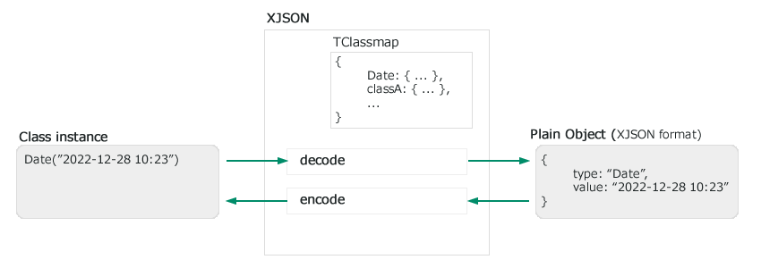

# XJSON - クラスを格納できるJSON

*Date オブジェクト を JSON にエンコードした。だけど、JSON デコードしたら 文字列になっていた*

これは別に不思議なことではありません。JSON にすれば Class に関するデータは消えてしまうからです。

そこで XJSON を提案します。
Xjson は JSON に準拠して、 Class 名を格納した JSON上位互換のフォーマットです。


```ts
// XJSON format (Plain object)
{
    "type": "MyClass",
    "apple": "pie",
    "orange": "cake"
}
```

大きな特徴は `'type': 'MyClass'` のようにクラスの情報を格納します。
これにより、エンコード・デコードしたときに適切にクラスを復元できるようになります。




## 使用例


xjson.encode, xjson.decode を使用する方法

```ts
let xjson = new xjson({  .... });

// decode 
let data = xjson.decode( JSON.parse(xjsonString) )

// encode 
let xjsonString = JSON.stringify( xjson.encode(data) );

```


JSON.parse, JSON.stringify を使用する方法

```ts
let xjson = new xjson({  .... });

// decode 
let data = JSON.parse(xjsonString, xjson.reviver);

// encode 
let xjsonString = JSON.stringify(data, xjson.replacer);

```


xjson.parse, xjson.stringify を使用する方法

```ts
let xjson = new xjson({  .... });

// decode 
let data = xjson.parse(xjsonString);

// encode 
let xjsonString = xjson.stringify(data);

```


## API


### constuctor


```ts
constructor(classmap : TClassmap = {})
```

| Argument       | Type        | Required | Description                                                  |
| -------------- | ----------- | -------- | ------------------------------------------------------------ |
| `classmap`     | `TClassmap` |          | クラスの相互変換テーブル                                     |


### reviver

JSON.parse() の reviver として使用できます

```ts
reviver(key:null|string, value:any) => any
```
| Argument       | Type            | Required | Description                                                  |
| -------------- | --------------- | -------- | ------------------------------------------------------------ |
| `key`          | `null`|`string` | Yes      |                                                              |
| `value`        | `any`           | Yes      |                                                              |
| **returns**    | `any`           |          |                                                              |


### replacer

JSON.stringify() の replacer として使用できます

```ts
replacer(key:null|string, value:any) => any
```
| Argument       | Type            | Required | Description                                                  |
| -------------- | --------------- | -------- | ------------------------------------------------------------ |
| `key`          | `null`|`string` | Yes      |                                                              |
| `value`        | `any`           | Yes      |                                                              |
| **returns**    | `any`           |          |                                                              |


### parse

Xjson形式の変数 を JSON 文字列 へ変換します

```ts
parse(value:string) => any
```
| Argument       | Type            | Required | Description                                                  |
| -------------- | --------------- | -------- | ------------------------------------------------------------ |
| `value`        | `string`        | Yes      | JSON文字列                                                   |
| **returns**    | `any`           |          | Xjson形式の変数                                             |


### stringify

Xjson形式の変数 を JSON 文字列 へ変換します

```ts
stringify(value:any) => string
```


| Argument       | Type            | Required | Description                                                  |
| -------------- | --------------- | -------- | ------------------------------------------------------------ |
| `value`        | `any`           | Yes      | XJSON形式の変数                                             |
| **returns**    | `string`        |          | JSON文字列                                                   |


### decode

JavaScriptのプレーンな変数からXjson形式の変数へデコードする

```ts
decode(value:any) => any
```

| Argument       | Type            | Required | Description                                                  |
| -------------- | --------------- | -------- | ------------------------------------------------------------ |
| `value`        | `any`           | Yes      | JavaScriptのプレーンな変数                                   |
| **returns**    | `any`           |          | XJSON形式の変数                                             |


### encode

Xjson形式の変数を JavaScriptのプレーンな変数にエンコードする

```ts
encode(value:any) => any
```

| Argument       | Type            | Required | Description                                                  |
| -------------- | --------------- | -------- | ------------------------------------------------------------ |
| `value`        | `any`           | Yes      | XJSON形式の変数                                             |
| **returns**    | `any`           |          | JavaScriptのプレーンな変数                                   |


## TClassmap

TClassmap は XJSON 形式のデータと実際の JavaScript のデータとを相互変換するためのテーブルデータです。


コンストラクタでの TClassmap の指定例

```ts
class ClassB extends Persistable {
	public name = 'this is ClassB';
}

let xjson = new xjson({

	// TResolver 方式
	'classA' : {
		test: ClassA,
		serialize: (data:any)=>{
			return _.toPlainObject(data);
		},
		unserialize: (data:any)=>{
			let obj = new ClassA();
			for(let [k, v] of Object.entries(data) ){
				(obj as any)[k] = v;
			}
			return obj;
		},
	},

	// IPersistable 方式
	'classB' : ClassB,
});
```

### IPersistable

IPersistable インタフェースには 次のメソッドを備える必要があります。


#### xjsonSerialize

```ts
xjsonSerialize() => any;
```

| Argument       | Type      | Required | Description                                                  |
| -------------- | --------- | -------- | ------------------------------------------------------------ |
| **returns**    | `any`     |          | エンコードした値                                             |


**例**

```ts
	public xjsonSerialize(){
		return this;
	}
```


#### xjsonUnserialize

```ts
static xjsonUnserialize(data:Object) => any;
```


| Argument       | Type      | Required | Description                                                  |
| -------------- | --------- | -------- | ------------------------------------------------------------ |
| `data`         | `any`     |          | デコードする値                                               |


**例**

```ts
	static xjsonUnserialize(data: Object){
		const self = new this();
		_.merge(self, data);
		return self;
	}
```


### TResolver


TResolver は、`test` メソッド や `serialize` メソッド 、 `unserialize` メソッド を含むオブジェクトです。 


#### test

エンコードできるかどうか判別する。

```ts
test(data:any) => boolean;
```


| Argument       | Type      | Required | Description                                                  |
| -------------- | --------- | -------- | ------------------------------------------------------------ |
| `data`         | `any`     |          | エンコードする値                                             |
| **returns**    | `any`     |          | エンコードできるなら `true` できないなら `false` を返します  |


#### serialize

```ts
serialize(data:any) => any;
```


| Argument       | Type      | Required | Description                                                  |
| -------------- | --------- | -------- | ------------------------------------------------------------ |
| `data`         | `any`     |          | エンコードする値                                             |
| **returns**    | `any`     |          | エンコードした値                                             |


#### unserialize

```ts
unserialize(data:any) => any;
```


| Argument       | Type      | Required | Description                                                  |
| -------------- | --------- | -------- | ------------------------------------------------------------ |
| `data`         | `any`     |          | デコードする値                                               |
| **returns**    | `any`     |          | デコードした値                                               |

